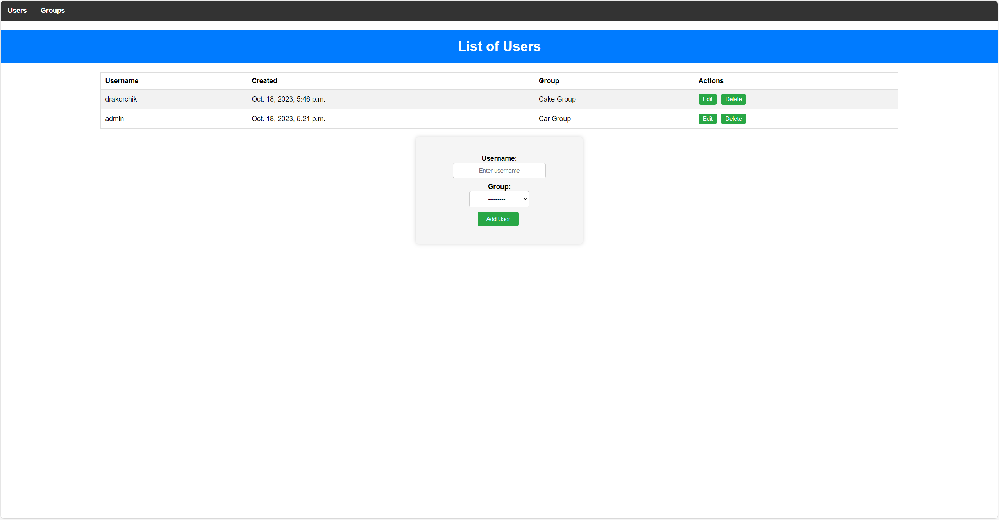
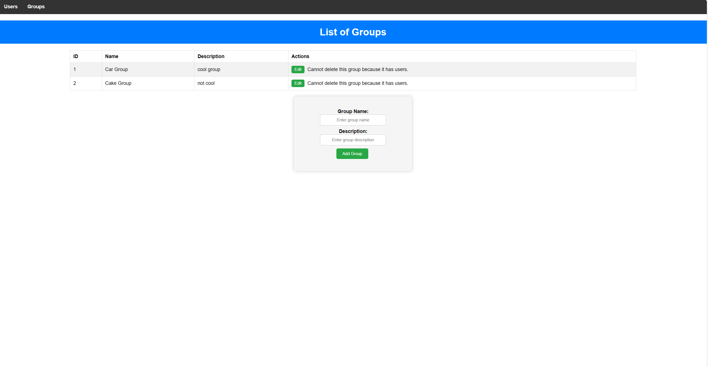

# Task Test
## Description of the first page:
List of Users consist of: username, created, group, actions.
username – User nickname 
created – Date of creating the user
group - Group, to which the user will be added 
actions – two buttons 'Edit' and 'Delete'

Also, under the list there should be a button `Add User`
for editing and adding new pages with such fields: username (text input) and group(select)

## Description of the second page:

The list of groups should consist of: ID, Name, Description, Actions.
Actions – `Edit` and `Delete` buttons 
Also, under the list there should be a button `Add Group`
For editing and adding new pages with such fields: Name (text input) and Description (text input).
Group deletion is impossible if the user is assigned to this group.

# Installation
Python3 and Django must be already installed

```
git clone https://github.com/drakoRRR/testTaskUsers
cd testTaskUsers
python -m venv venv
venv\Scripts\activate (on Windows)
source venv/bin/activate (on macOS)
pip install -r requirements.txt
python manage.py migrate
python manage.py runserver
```
## Docker
```
docker-compose up --build django_project
docker-compose up
```

Also, you need to set up the .env file as it is set up in the `.env.example` file.

# Technology Stack
* Python/Django/DjangoORM
* PostgreSQL
* HTML/CSS
* Docker

# List of Users:


The page displays a list of users, including their username, creation date, assigned group, and action buttons.
You can edit or delete each user.
There's an "Add User" button for creating new users.
When adding or editing a user, you can enter a username and select a group.


# List of Groups:


The page displays a list of groups, including their ID, name, description, and action buttons.
You can edit or delete each group.
There's an "Add Group" button for creating new groups.
Group deletion is restricted if users are assigned to the group.